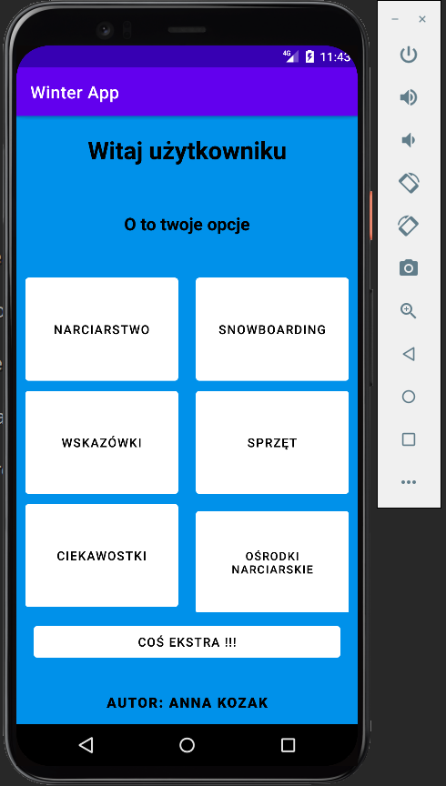

# Android WinterApp
###Android WinterApp - is an application made for the Android mobile system. The application was made in Kotlin and Java language.
####After cloning the project, we run the project in an environment designed for Android, for example Android Studio and fire up the application in the standard way.
####The structure of the project is based on classes (activities) written in Kotlin and Java, while the data entered by the user is stored in a database managed by the SQLite system.

#### The res directory contains:
* drawable directory, which contains graphics used in the application;
* layout directory, which contains 10 files containing layouts;
* values directory, in which there is a file containing declarations of default strings;
* values-de directory, in which there are files containing string declarations in German;
* values-en directory, which contains files containing string declarations in English;
* values-pl directory, which contains files containing string declarations in Polish;

#### After launching the application, the main panel of the application appears, where the user has a choice of five battones (buttons) for skiing and snowboarding topics, one button (button) for the sport of swimming and one button for sports topics. 

1. The "Skiing" button, redirecting to a new activity with a static part of the app discussing skiing styles.

2. The "Snowboardnig" button, redirecting to a new activity with a static part of the app discussing snowboarding styles.

3. The "Tips" button, redirecting to a new activity with a static section of the app discussing types of skiing and snowboarding equipment.
   
4. The "Trivia" button, redirecting to a new activity with a static section of the app discussing trivia from the world of sports.

5. The "Ski Resorts" button, redirecting to a new activity with buttons that allow you to go to a site showing ski resorts around the world.

6. The "Equipment" button redirects to a new activity, where the user has the option to go to an activity that allows the user to enter the data needed to determine the best-fitting ski or snowboard equipment parameters for the user. The user also has the option to add their parameters to the database, search for them, or delete them. And he also has the option to clear the form to enter new data. 
Then, after clicking on the "Confirm" button, the user will be taken to the previous activity, which will display the previously entered parameters specifying the user's height, weight, foot length, type of sport, skill level and riding style. After clicking the appropriate button, the user will get feedback on what equipment is best for him at the moment. 

7. Button "Something extra" redirecting to a new activity, where there is a short form for entering data specifying the number of pools swum, and the length of a given pool. Once the data is entered, pressing the "Show" button will open a new activity to which the previously entered data will be transferred, as well as a button that allows us to convert the number of pools swum of the corresponding length into meters and kilometers.

 
